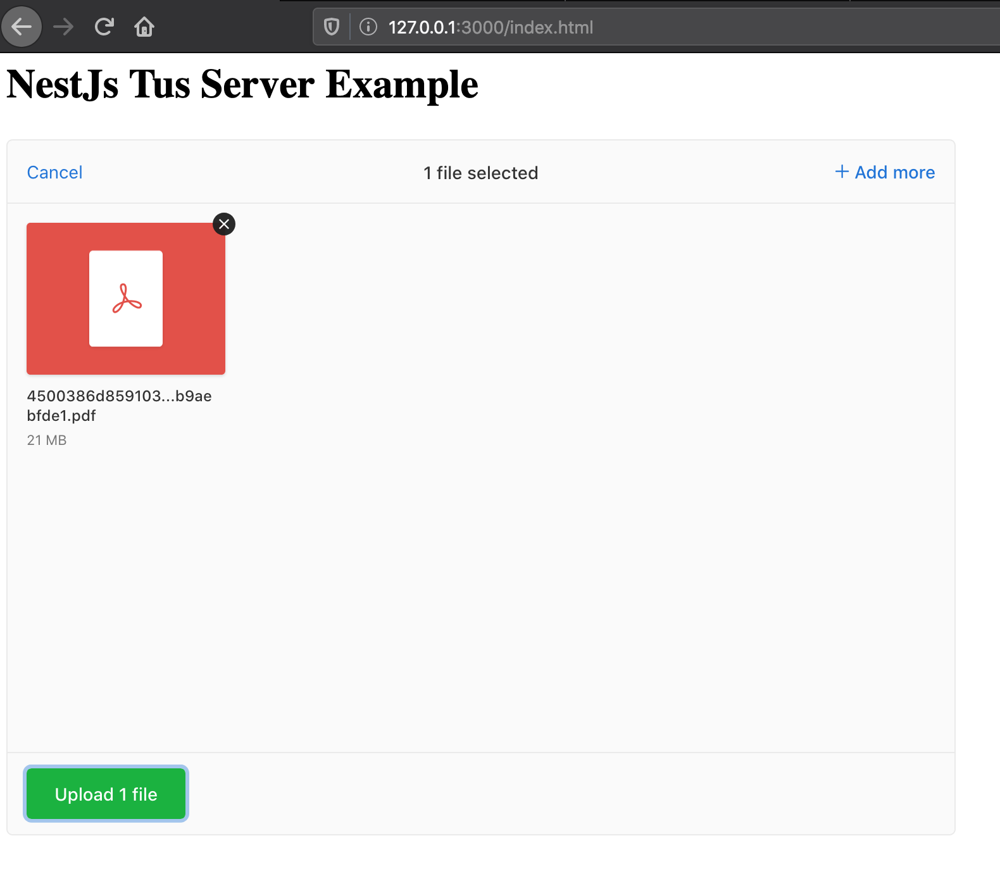
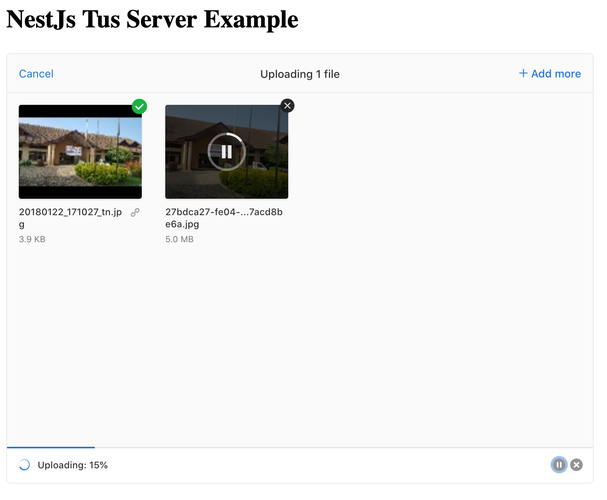

# NestJs Tus Server Example

> ## Motivation
>
> I wrote this demo code while researching use of Resumable upload implementation for NestJS, as a way for myself to tinker with different implementation before I include in production code, and also to provide me with quick reference in the future.

## Description

An example implementation of [TUS](https://tus.io) file server in [NestJS](https://github.com/nestjs/nest) framework.

## Installation

```bash
$ npm install
```

Initialize env file.

```bash
$ cp .env.example .env
```

By default this uses the local file store option, but can also store to S3. Need to provide AWS config in .env for this to work.

## Running the app

```bash
# development
$ npm run start

# watch mode
$ npm run start:dev

# production mode
$ npm run start:prod
```

Open browser to access demo frontend at URL below

[http://127.0.0.1:3000/index.html](http://127.0.0.1:3000/index.html)

#### Frontend using Uppy uploader



#### Uploading...



### Bookmarks

Below are some material I found helpful when researching use of Tus Protocol for resumable uploads in NodeJS

- Tus.io S3 File Store https://tus.io/blog/2016/03/07/tus-s3-backend.html

- JSConfUS 2013 Talk on Tus.io https://www.youtube.com/watch?v=ilCxWswGm1I

- Can TUSD run in AWS Lambda - NO https://github.com/tus/tusd/issues/291

- Uppy AWS S3 Multipart https://uppy.io/docs/aws-s3-multipart/
